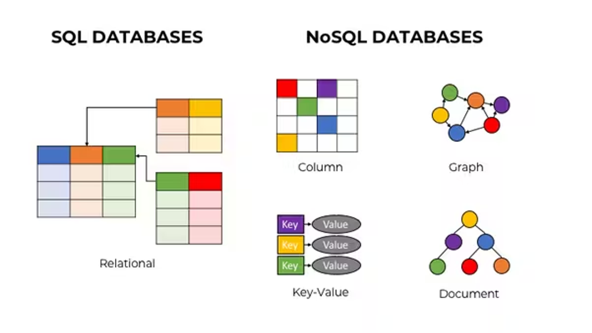
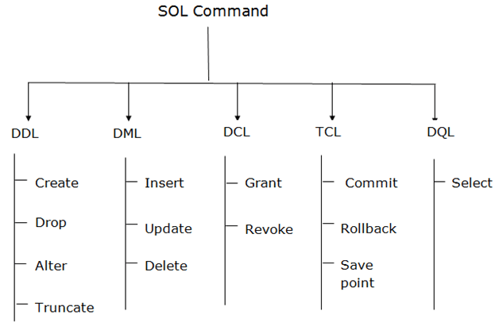

# Dia 002 - SQL vs NoSQL

  

### O que é SQL?
- SQL significa *Structured Query Language*
- Nos anos iniciais de seu desenvolvimento, bancos SQL eram focados em reduzir dados duplicados devido ao alto custo de armazenamento de informações
- Com SQL é possível armazenar, manipular e obter dados de bancos de dados relacionais utilizando queries
    - **SQL query** → comando mais básico de SQL utilizado para obter dados de um banco de dados

  

- Em bancos de dados relacionais os dados são organizados em tabelas que podem estar relacionadas com outras
  
- Cada tabela consiste de colunas e linhas. As colunas possuem um nome, relativo ao conteúdo que armazenam em suas linhas, e um tipo de dado (texto, número, data, hora, …)

- Devido a sua organização, bancos SQL necessitam de organização e planejamento prévio
- Bancos SQL escalam verticalmente, para aumentar a capacidade ou desempenho do banco é necessário melhorar o hardware. Envolvendo a melhoria do processador, memória RAM ou disco rígido. No entanto, a escalabilidade tem limitações físicas, visto que o hardware pode atingir seu limite máximo
- RDBMS (Relational Database Management System) são programas utilizados para gerenciar bancos relacionais. Alguns RDBMS são: MySQL, PostgreSQL, MariaDB e Oracle. Eles devem possuir quatro propriedades:
    - **Atomicidade**: Todas as transações devem ser completas (suceder ou falhar) e não devem ser deixadas parcialmente completas, mesmo no caso de falha do sistema
    - **Consistência:** O banco de dados deve seguir regras que validam e preveem corrupções em todas as etapas
    - **Isolamento:** Transações concorrentes não devem afetar uma a outra
    - **Durabilidade:** Mesmo após uma falha as transações completas não devem ter “roll back”

### O que é NoSQL?
- O melhor significado para o nome seria “not only SQL”, visto que as vezes bancos de dados NoSQL suportam comandos SQL
- Bancos NoSQL permitem diferentes estruturas de armazenamento, não somente tabelas como o bancos SQL
- Devido ao seu esquema dinâmico para dados não estruturados, são necessários menos planejamento e organização prévios, sendo mais fácil fazer modificações
- Bancos não relacionais geralmente possuem uma das seguintes estruturas:
    - **Modelo colunas:** Os dados são armazenados em colunas, que possuem uma flexibilidade em sua estrutura. Útil para armazenar grandes volumes de dados com diferentes tipos de informação. Exemplos incluem o Apache Cassandra
    - **Modelo chave-valor:** Os dados são armazenados como pares de chave e valor, onde a chave é utilizada para identificar e acessar o valor associado a ela. Eficaz para armazenar e recuperar informações de forma simples e rápida. Exemplos incluem o Redis e o Amazon DynamoDB
    - **Modelo documento:** Os dados são armazenados em documentos (XML, YAML, JSON e BSON) que podem ter uma estrutura flexível e diferente dos outros documentos na mesma coleção. Exemplos incluem o MongoDB
    - **Modelo grafos:** Utilizado para armazenar dados que tem relações complexas e interconexões. Eficaz para consultas complexas que envolver navegação por relacionamentos

- Bancos NoSQL escalam horizontalmente, podendo adicionar mais servidores para escalar o sistema
- Seguem a teoria CAP, que possui as três propriedades
    - **Consistência:** Cada request deve receber o resultado mais recente ou um erro
    - **Disponibilidade (Availability):** Cada request tem um resultado que não é um erro
    - **Tolerância a partições:** Qualquer atraso ou perda entre entidades (nodes) não deve interromper a operação do sistema

### Principais diferenças

| SQL | NoSQL |
| --- | --- |
| estrutura baseada em tabelas | estrutura de documentos, chave-valor, colunas ou grafo |
| rígido | flexível |
| escala verticalmente | escala horizontalmente |
| ORM (object-relational mapping) | Não necessita ORM |

### Quando usar SQL vs NoSQL

- SQL é uma boa opção quando lidando com dados que possuem relação. Quando um usuário atualiza um dado específico, cada instância do banco é atualizada automaticamente e a informação fica disponível em tempo real. Não sendo necessário atualizar em múltiplos documentos
- NoSQL é uma boa opção quando estamos lidando com modelos de dados flexíveis. Também possuem uma melhor escalabilidade, podendo lidar com quantidades massivas de dados

### Fontes

https://www.ibm.com/blog/sql-vs-nosql/

https://learnsql.com/blog/what-is-sql/

https://learnsql.com/blog/what-is-sql-query/
