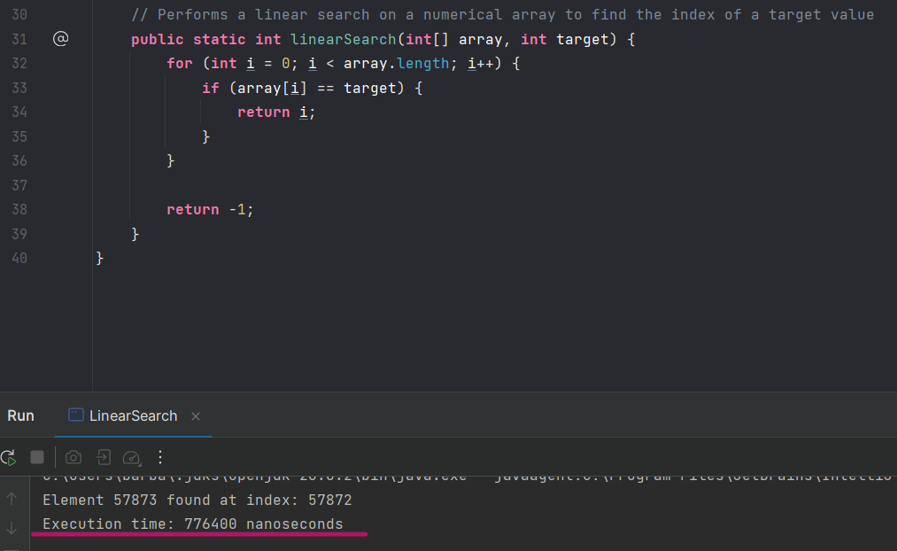
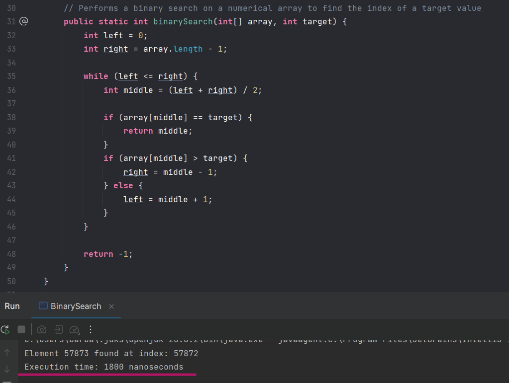

### Linear Search
Considerando um array numérico de 1 a 100000, o tempo de execução do código para achar o elemento 57873 foi igual a 776400 nanosegundos.

  

### Binary Search
Considerando o mesmo array e valor alvo do caso anterior, o tempo de execução do código foi igual a 1800 nanosegundos.

  

