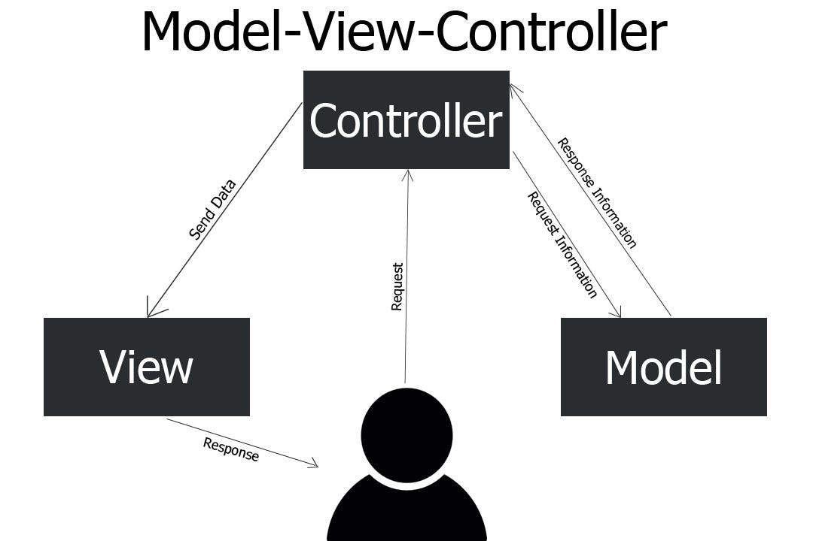
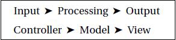

# Dia 004 - MVC

## O que é MVC?

- Model-View-Controller (MVC) é um modelo de arquitetura de aplicação que separa o código em três componentes principais bem definidos
- Tem como função isolar as regras de negócio da camada de interface do usuário
- Pode ser utilizado em vários tipos de projeto: desktop, web e mobile

  

### Controller

- Interpreta as entradas enviadas pelo usuário, atuando como um intermediário entre as camadas Model e View
- Não possui lógica de negócio complexa, tem como principal função processar as requests por parte do usuário e coordenar a interação entre as outras camadas
- Focada em garantir que as requests do usuário sejam corretamente encaminhadas a Model e que as informações necessárias sejam enviada a View

### Model

- Camada responsável pelas regras de negócio e pelo gerenciamento dos dados da aplicação
- Possui integração com APIs, bancos de dados e etc. Retornando as informações necessárias para a Controller
- Geralmente responsável por implementar as operações CRUD (Create, Read, Update, Delete)
- Não tem conhecimento da interface do usuário

### View

- Camada responsável pela apresentação da interface gráfica ao usuário e pela interação com ele
- O usuário interage diretamente com essa camada, por meio de cliques de botão, digitação no teclado e toque
- Não possui acesso direto a camada Model ou lógica de negócios, ela encaminha ao Controller as interações do usuário para que as ações necessárias sejam tomadas
- Exibe os dados fornecidos pela camada Model de forma compreensível ao usuário
- Pode ser adaptada a diferentes dispositivos, como desktops ou celulares

  

## Vantagens

1. **Separação de responsabilidades -** Cada um dos três componentes possui um papel específico e independente, tornando mais fácil o desenvolvimento e manutenção do código
2. **Modularidade -** Cada componente é independente de modo que pode ser desenvolvido, testado e alterado separadamente
3. **Flexibilidade -** A separação de responsabilidades permitem que mudanças sejam feitas na View sem alterar a lógica da Model, e vice-versa
4. **Aprimoramento da compreensão -** A organização da MVC torna o código mais legível e compreensível

## Desvantagens:

1. **Complexidade inicial -** A implementação inicial é mais complexa devido a separação de responsabilidades entre as camadas
2. **Curva de aprendizado -** Para desenvolvedores não familiarizados pode haver uma curva de aprendizado para entender a organização do código
3. **Tamanho do código -** Ao aumentar o código o número de arquivos e classes pode aumentar consideravelmente, visto que cada camada está em um arquivo separado
4. **Overengineering -** Em alguns casos, pode levar a criação de uma arquitetura mais complexa do que as necessidades, causando uma complexidade desnecessária e aumentando o tempo de desenvolvimento
5. **Possível perda de performance -** Em alguns casos, o uso pode causar perda de performance devido a sobrecarga de comunicação entre os componentes